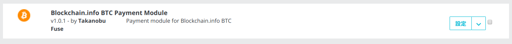
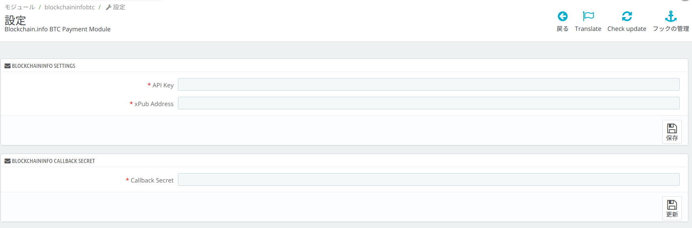
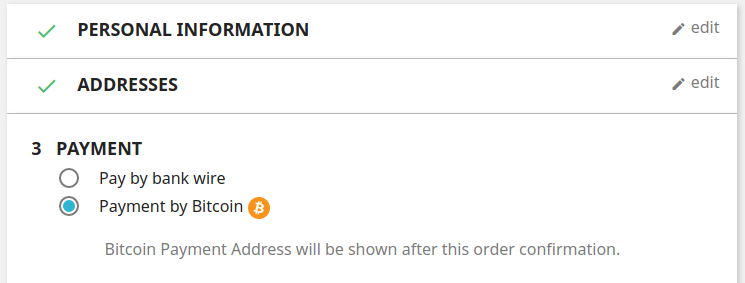
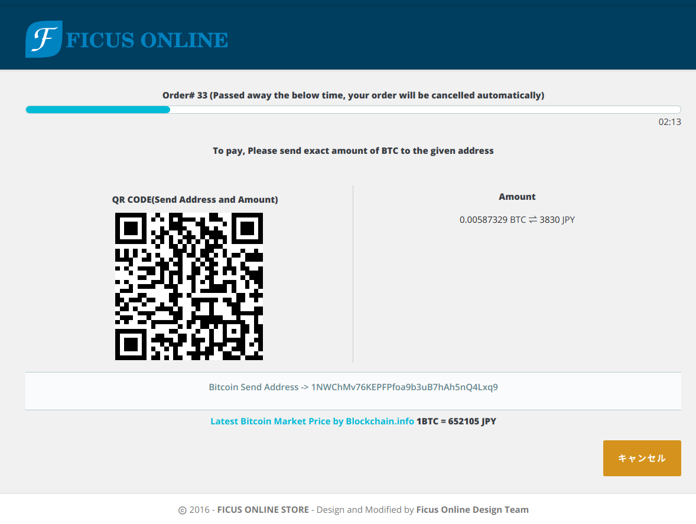

## Bitcoin Payment Module for Prestashop 1.7

This module includes some files for tesing, please delete these if not useful for your evaluation.

### Blockchain.info API V2 adopted.

The Blockchain Receive Payments API V2 is the quickest and easiest way to begin accepting automated bitcoin payments. Consisting of just a simple HTTP GET request, you can be up and running in minutes.

One of the difficulties involved with receiving bitcoin payments is the need to generate a unique address for each new user or invoice. These addresses need to monitored and stored securely. The blockchain receive payments API takes care of the generation and monitoring of addresses. Blockchain.info will notify your server using a simple callback whenever a payment is received.

You have to register on Blockchain.info wallet account, and get an API key and xPub.

### Requesting an API key Get access to Blockchain.info APIs

In order to use the Receive Payments API V2, please apply for an API key at https://api.blockchain.info/v2/apikey/request/. This API key is only for Blockchain.info Receive Payments API. You cannot use the standard blockchain wallet API key for Receive Payments V2, and vice versa.

Obtaining an Extended Public Key (xPub) xPubs can be created with our new Blockchain Wallet.

This API requires you to have a BIP 32 account xPub in order to receive payments. The easiest way to start receiving payments is to open a Blockchain Wallet at https://blockchain.info/wallet/#/signup. You should create a new account inside your wallet exclusively for transactions facilitated by this API. When making API calls, use the xPub for this account (located in Settings -> Addresses -> Manage -> More Options -> Show xPub).

### Bitcoin Donation for bug fixing fee.

bitcoin:1FCGtpKEyCtHNU3EKBJ6wXXtXP1CcTPe8t

